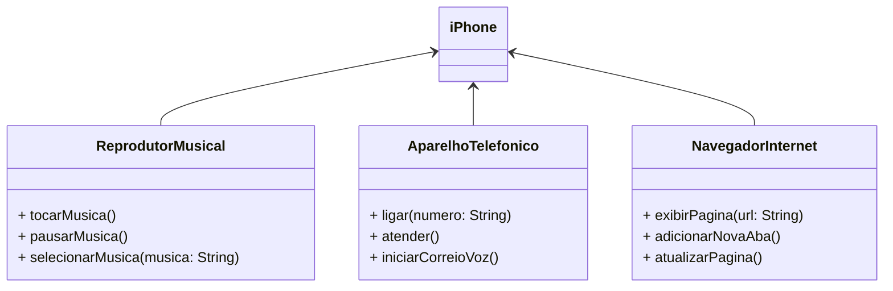

# Abstraction of an iPhone in Java and represented with UML

 In this challenge, I used my knowledge of object-oriented programming and Java syntax to complete the challenge proposed by DIO.

```mermaid
classDiagram
    class ReprodutorMusical {
        + tocarMusica()
        + pausarMusica()
        + selecionarMusica(musica: String)
    }

    class AparelhoTelefonico {
        + ligar(numero: String)
        + atender()
        + iniciarCorreioVoz()
    }

    class NavegadorInternet {
        + exibirPagina(url: String)
        + adicionarNovaAba()
        + atualizarPagina()
    }

    class iPhone {
    }

    iPhone <-- ReprodutorMusical
    iPhone <-- AparelhoTelefonico
    iPhone <-- NavegadorInternet

```